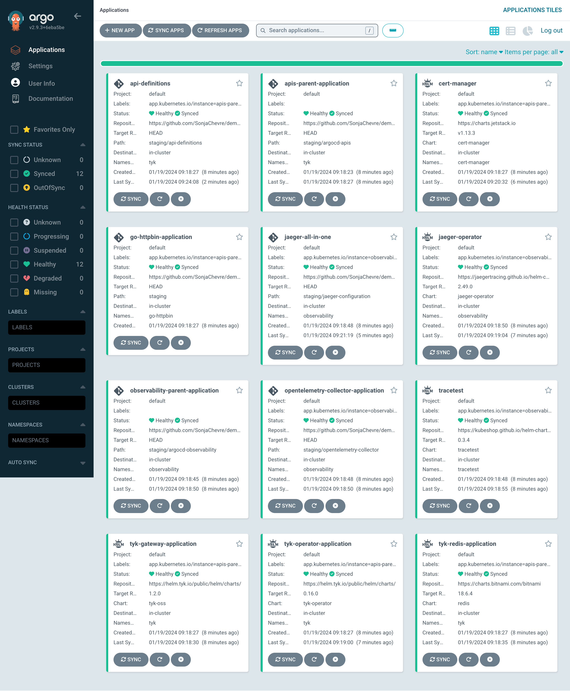

# Deploy Fast, Without Breaking Things: Level Up APIOps With OpenTelemetry

This is a demo project for the talk "Deploy Fast, Without Breaking Things: Level Up APIOps With OpenTelemetry" from [Sonja Chevre](https://www.linkedin.com/in/sonjachevre/) and [Adnan Rahić](https://www.linkedin.com/in/adnanrahic/).

This demo started as a fork from https://github.com/caroltyk/tyk-cicd-demo2. Thanks Carol for the inspiration!

Follow along to deploy 2 environments with ArgoCD, Tyk, OpenTelemetry, Jaeger and Tracetest. 

## Create local Kubernetes cluster for staging and production

 In this demo, we will assume 2 environments (staging and prod) running in [minikube](https://minikube.sigs.k8s.io/docs/start/):

```
minikube start -p staging
minikube start -p production
```

Later, to list the clusters:
```
minikube profile list
```

Then to switch cluster use [kubectx](https://github.com/ahmetb/kubectx):
```
kubectx staging
kubectx production
```

## Deployment Staging environment

Switch to the staging cluster: 

```
kubectx staging
```

## Install ArgoCD

Here are the commands needed to Install ArgoCD on your cluster. Refer to [ArgoCD documentation](https://argo-cd.readthedocs.io/en/stable/getting_started/) for more details. 

```
kubectl create namespace argocd
kubectl apply -n argocd -f https://raw.githubusercontent.com/argoproj/argo-cd/stable/manifests/install.yaml
```

Forward the local port 9080 to ArgoCD's secure port (443) to access ArgoCD UI interface:

```
kubectl port-forward svc/argocd-server -n argocd 9080:443
```

[Download and install Argo CD CLI](https://argo-cd.readthedocs.io/en/stable/getting_started/#2-download-argo-cd-cli) and retrieve default admin password:

```
argocd admin initial-password -n argocd
```

After following the steps below, this is how your ArgoCD instance should look like on the staging cluster: 


## Deploy APIs and API infrastructure (Tyk, Redis)

```
kubectl apply -f ./staging/argocd/application-apis.yaml
```

Try it out:

```
kubectl port-forward svc/gateway-svc-tyk-gateway-application -n tyk 8080:8080
```

* Tyk health endpoint: http://localhost:8080/hello
* go-httpbin: http://localhost:8080/httpbin/

### Deploy Observability stack (OpenTelemetry Collector, Jaeger, Tracetest)

```
kubectl apply -f ./staging/argocd/application-opentelemetry.yaml
```

Try it out:

```
kubectl port-forward svc/jaeger-all-in-one-query -n observability 16686:16686
```

* Make a couple of calls to: http://localhost:8080/httpbin/get
* Look at the distributed traces in Jaeger: http://localhost:16686

### Testing with Tracetest

Try it out:

```
kubectl port-forward svc/tracetest -n tracetest 11633:11633
```

#### Manually

Run a test manually:

Tracetest YAML test definition

```yaml
type: Test
spec:
  id: nf4f055Sg
  name: Test HTTPBin
  trigger:
    type: http
    httpRequest:
      method: GET
      url: http://gateway-svc-tyk-gateway-application.tyk.svc.cluster.local:8080/httpbin/get
      headers:
      - key: Content-Type
        value: application/json
  specs:
  - selector: span[tracetest.span.type="http"]
    name: "All HTTP Spans: Status code is 200"
    assertions:
    - attr:http.status_code = 200
```


#### Automated

[Hooks](https://argo-cd.readthedocs.io/en/stable/user-guide/resource_hooks/) are simply Kubernetes manifests tracked in the source repository of your Argo CD Application annotated with `argocd.argoproj.io/hook`.

The hook is part of the api-definitions projects, stored under ./staging/api-definitions/application-integration-tracetest.yaml

##### To update the integration tests

Build the Docker image for the hook.

```
docker build . -t <your_username>/demo-apiops-observability
```

Push the Docker image to Docker Hub.

```
docker push <your_username>/demo-apiops-observability:latest
```

(Optional): Use a prebuilt sample image:

```
adnanrahic/demo-apiops-observability:latest
```

Update the hook under ./staging/api-definitions/application-integration-tracetest.yaml
