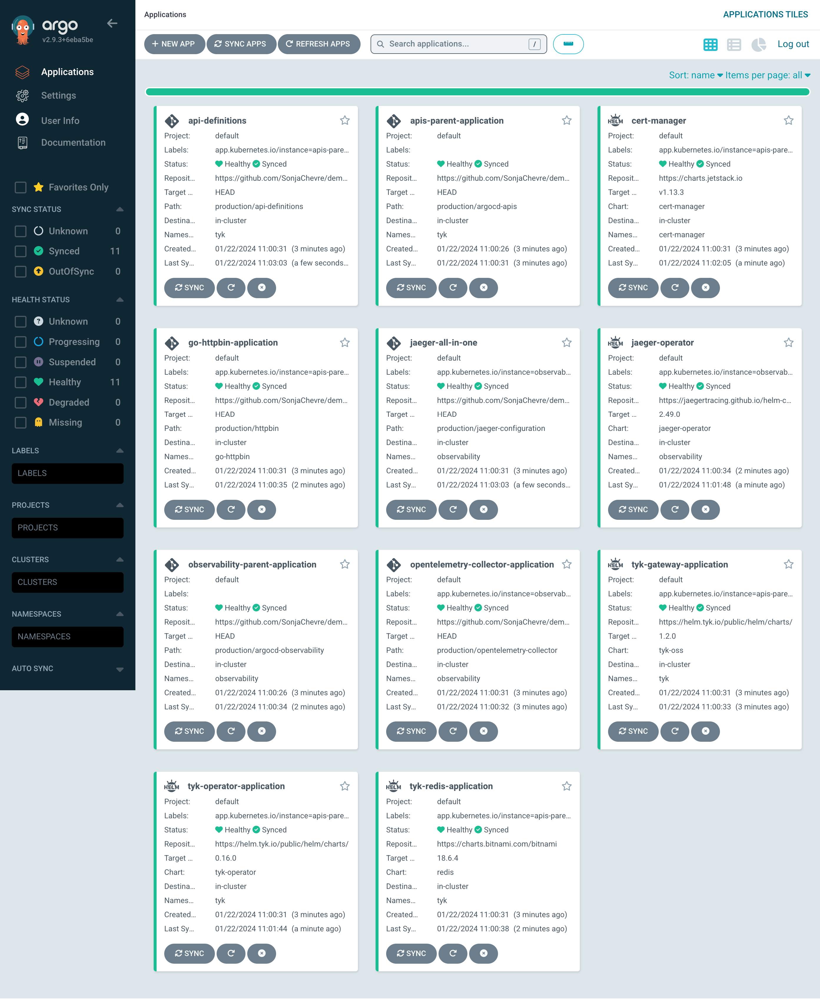

# Set-up Production environment

## Switch to the production cluster

```
kubectx production
```

## Install ArgoCD

Here are the commands needed to Install ArgoCD on your cluster. Refer to [ArgoCD documentation](https://argo-cd.readthedocs.io/en/stable/getting_started/) for more details. 

```
kubectl create namespace argocd
kubectl apply -n argocd -f https://raw.githubusercontent.com/argoproj/argo-cd/stable/manifests/install.yaml
```

## Log in to ArgoCD

Forward the local port 9081 to ArgoCD's secure port (443) to access ArgoCD UI interface:

```
kubectl port-forward svc/argocd-server -n argocd 9081:443
```

[Download and install Argo CD CLI](https://argo-cd.readthedocs.io/en/stable/getting_started/#2-download-argo-cd-cli) and retrieve default admin password:

```
argocd admin initial-password -n argocd
```


## Create ArgoCD applications

```
kubectl apply -f ./production/argocd/application-apis.yaml
kubectl apply -f ./production/argocd/application-observability.yaml
```

After following the steps below, this is how your ArgoCD instance should look like on the staging cluster (wait for all applications to be synchronized): 


## Try it out

### Tyk

Forward the port 8081:

```
kubectl port-forward svc/gateway-svc-tyk-gateway-application -n tyk 8081:8080
```

* Tyk health endpoint: http://localhost:8081/hello
* go-httpbin: http://localhost:8081/httpbin/get

### Jaeger

Forward the port 16687:

```
kubectl port-forward svc/jaeger-all-in-one-query -n observability 16687:16686
```

* Jaeger: http://localhost:16687